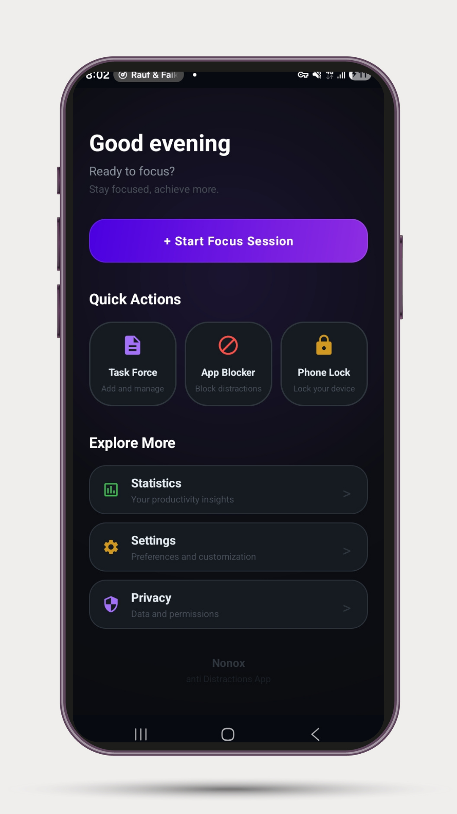
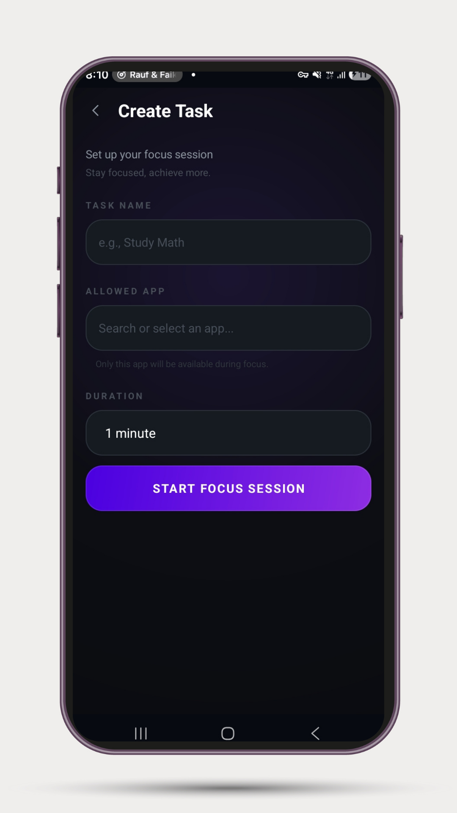
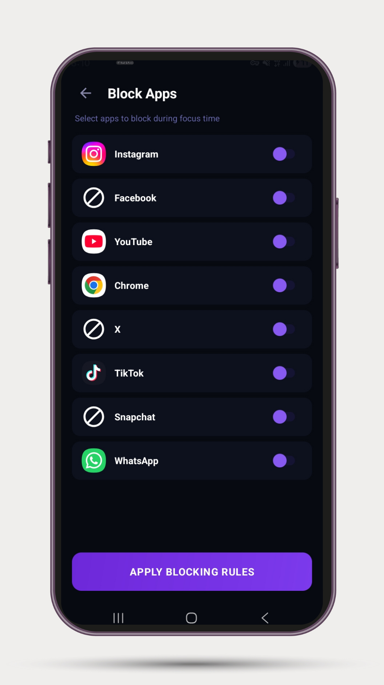
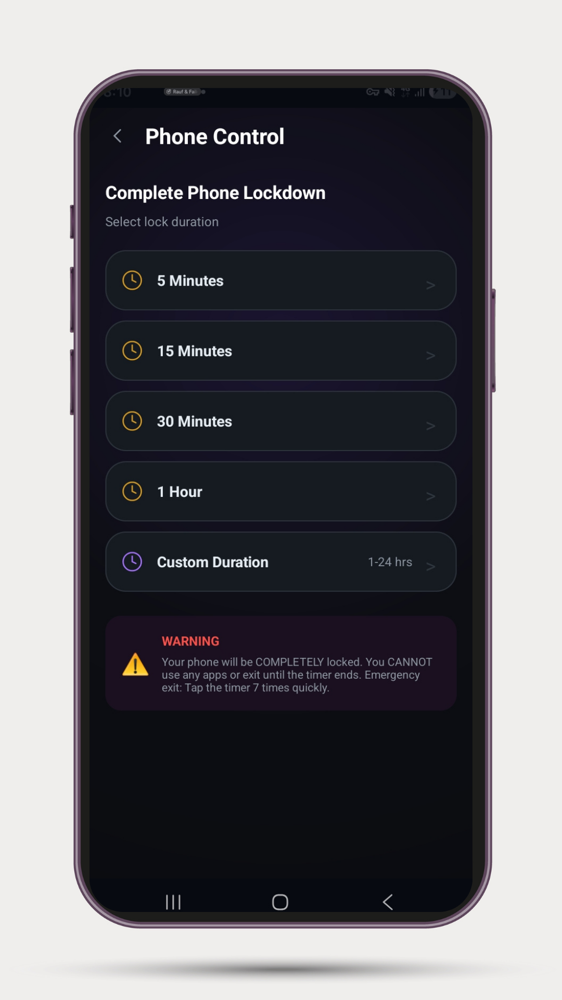

# NONOX — Force Your Focus

> **The nuclear option for focus. No escape. No compromise.**

NONOX is an anti-distraction productivity system that **forces you to focus**. Built for people who are tired of losing to their phones.

---

## 📱 Screenshots

  
  
  
  

---

## 🔥 Features

| Feature | Description |
|---------|-------------|
| **🔒 24-Hour App Lock** | Block distracting apps completely. Once locked, there is no turning back until the timer expires. |
| **📱 Complete Phone Lockdown** | Turn your device into a dedicated tool. No notifications, no sounds, no excuses. Survives restarts. |
| **🎯 Single-App Focus** | Lock yourself into one specific application. The only way out is to finish what you started. |
| **📊 Discipline Tracking** | Monitor your progress with deep analytics. Earn your discipline score and visualize your growth. |
| **📈 Statistics Dashboard** | Track focus time, tasks completed, exit attempts, and discipline score over 7 days. |
| **🔐 Privacy-First** | All data stays on your device. No cloud uploads. No tracking. |

---

## 📥 Download

### Latest Release

**Version:** v1.0.0  
**Size:** 5.74 MB  
**Requires:** Android 8.0+

---

## 🚀 Installation

1. **Download** the APK from the link above
2. **Enable** "Install from Unknown Sources" in your Android settings
3. **Open** the downloaded APK file
4. **Tap** Install
5. **Open** NONOX and start focusing!

---

## 🛠️ Tech Stack

| Technology | Purpose |
|------------|---------|
| **Java** | Core language |
| **Android Native** | Platform |
| **SQLite** | Local data storage |
| **AIDE** | IDE (built on a 6-inch phone) |
| **GitHub** | Version control |
| **DeepSeek & Gemini** | AI support |

---

## 🧠 About the Developer

**Geda Taye** is a 22-year-old self-taught developer from Harar, Ethiopia.

- Built NONOX entirely on a 6-inch smartphone
- No laptop. No team. No excuses.
- 8,500+ lines of Java
- 420+ hours of development

**His Vision:**
> *"I'm not building an app. I'm building a movement. I want to show the world that talent exists everywhere — even in Ethiopia, even on a phone."*

**Other Projects:**
- [**Jaba Shop**](https://jabashop.store/) — Ethiopia's #1 Digital Hub (1,000+ students)
- **PINAXA** — Personal safety app with offline panic activation

---

## 🤝 Connect

| Platform | Link |
|----------|------|
| **Telegram** | [@NONOX_App](https://t.me/nonoxapp) |
| **Twitter/X** | [@GedaTaye41598](https://x.com/GedaTaye41598) |
| **LinkedIn** | [Geda Taye](https://www.linkedin.com/in/geda-taye-a60b403ba) |
| **Email** | [jabataye@gmail.com](mailto:jabataye@gmail.com) |

---

## 📄 License

© 2026 Geda Taye. All rights reserved.

This project is proprietary software. You may not modify, distribute, or sell this software without permission.

---

## ⚠️ Disclaimer

Emergency calls (911, 112, etc.) are **ALWAYS** allowed through NONOX, regardless of lockdown status.

---

## ⭐ Show Your Support

If you find NONOX helpful, please:
- ⭐ Star this repository
- 📢 Share it with someone who needs focus
- 💬 Join our [Telegram community](https://t.me/nonoxapp)

---

**Built with ❤️ in Harar, Ethiopia 🇪🇹**

*Stay focused. Achieve more.*
